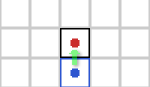

# Project 7: Board Game
Project 7 involves the design, implementation, and testing of a networked multiplayer board game following the 3-tier software architecture (client, server, database). 
You may choose to either to make the classic board game 'checkers' or 'CodeBowl'. 

# High Level Non-Functional Requirements
- multi-user networked system
- 3-tier architecture
    - Client: browser, desktop app, mobile app, VR, or ability to use multiple clients
    - Server: Ruby on Rails, Django, Laravel, node.js
    - Database: SQL
- sound OOP design with reasoning for all design choices
- attention to common security concerns
- attention to privacy concerns with varying resource access for different types of users
    - guests: users who do not have accounts and have restricted access to the system
    - registered users: users who can    

# High Level Functional Requirements
- Authentication System
    - register: Guests can register new account 
    - login: Guests can log in to their account
    - password recovery/reset: Guests can request that system send them an email with the ability to reset or recover their password 
- User Management System
    - retrieve user statistics: (win rate, previous matches for user, etc) 
    - private chat: registered users can chat with other registered users from any screen
    - search for game: registered users may search for an opponent to play a game against
    - initiate game: registered users may initiate a game
- Game Tracking System
    - view game history: users may view records of previous games including participants, winner, score
    - spectate: guests and registered users may join a game session and observe without affecting the game
- Game System
    - game initialization: initial game state
    - turn-based game progression: system recognizes valid moves and updates game state until a win condition occurs
    - game session chat: user may chat with opponent in match
    - results: when win condition occurs, game tracking system is updated with data about the outcome of the game

# Checkers Game Description
Checkers is a 1v1, competitive, turn-based, tile-based game where you move your pieces with the goal of eliminating all opponent pieces or force the opponent into a position where they can not make a valid move. 

### Checkers Overall Gameflow
1. The board is set up with 8x8 alternating black and white square tiles. 12 pieces from each team are placed on opposing sides of the board like so: 
2. At the beginning one of the two players is randomly selected to control the black pieces. The other player plays the red pieces.
3. The player controlling black pieces makes a valid move with one of their pieces
4. The player controlling the red pieces makes a valid move with one of their pieces
5. Players alternate making valid moves with 1 of their pieces until the end of the game is reached during one of the following 3 conditions: 
    - one team captures all of their opponent's pieces. the remaining team is the winner
    - one team forces another team into a position where the other team can not make valid moves. The team that can still make valid moves is the winner
    - both teams are unable to make any valid moves. the team with the most 'king' pieces is the winner. 

# valid moves 

 
 
<i> 
    Regular pieces may make 1-tile moves diagonally towards the opponent side.
</i>

 
 
<i> 
    if an opponent piece is diagonal and adjacent and the tile behind the opponent piece is unoccupied, you must jump over the opponent piece. This 'captures' the opponent piece and it is is removed from the board for the rest of the game
</i>

 
 
<i> 
    If there are multiple alternating tiles that are empty and have opponent pieces, you must jump multiple times, capturing each opponent piece.
</i>

# king piece

 
 
<i> 
    If a piece moves into the final row of their opponents half, the piece is promoted to a king piece. In the tabletop version, this is shown by stacking another piece on top of it. King pieces may perform all the same moves as a regular piece, but can do so both towards or away from the opponent's side. 
</i>

# CodeBowl Game Description
CodeBowl is a 1v1, turn-based, tile-based, risk-management board game with RPG elements. It is based on team ball sports like soccer/american football but with ability to knock players out of the game. Teams of 7 players spread out on 20Lx11W tile board and attempt to score points by carrying the ball to their opponent's goal zone. Any action taken by a player has a chance to fail, though users may reduce that chance with careful positioning and consideration of player stats. The winner of the game 
is the player who has scored the most points after 16 turns or the player who has removed all opponent players from the board. 

### CodeBowl Overall Game Flow
1. One team is randomly chosen to play offense, the other plays defense. 
2. The defensive team places their players on their half of the board, then the offensive team places their players on their half of the board
3. The ball is randomly placed on the offense team's half of the board  
4. The offensive team performs a turn having each player move, attack, or pick up ball
5. The defensive team performs a turn having each player move, attack, or pick up ball. Teams continue taking alternating turns.
6. After turn 8, the game resets. Offensive team is now defensive team, and vice versa. Pieces are placed and ball is dropped on offensive side.
7. Teams continue taking turns until the end of the 16th turn or when all players from a team are eliminated. 
8. Game continues until end of 16th turn or all players of a team are removed from the board. 

 
<i> After both users place their players, the ball is placed on a random tile on the offense team's half of the board and the offensive team begins its first turn. </i>

### Turnover Mechanic
Many actions cause a turn to end when a team has not finished performing an action on all players. 
- attempting to pick the ball up and failing (66.6% success, 33.3% failure). Failure also scatters ball to random adjacent square.
- attempting to attack an enemy and failing (50% success, 25% no effect, 25% failure)
- attempting to run OUT OF a tile adjacent to an opponent player (66.6% success, 33.3% failure)
- when a team successfully scores, their turn is over. The other team becomes offense, and the game goes through initial setup (place pieces, place ball, offense starts first turn)

### Combat Details:
A player may attempt to move into an adjacent player in order to attempt an attack. You may not move and then attack, you can only attack enemies already adjacent to you at the beginning of your action. An attack between 2 players will have a 50% chance to knock the player down, a 25% chance to have no effect, and a 25% chance to knock the attacker down ending that user's turn prematurely. If a player attempts an attack and one of his teammates is also adjacent to the target player, there is a 75% chance to knock the player down, a 20% chance to have no effect, and a 5% chance to fail the attack. A successful knockdown moves the attacker into the tile where the target was, and the target back one tile in the direction of the attack.

 
<i> Blue player sets up an attack on red player with 50% chance success </i>

 
<i> Blue player sets up attack on red player with 75% chance success because another blue player is adjacent to target</i>

### Knockdown and Injury Details:
If a player fails an attack or receives a successful attack they are knocked down. This means they drop the ball if they have it and that they must 'stand up' their next action, causing a -3 penalty to their movement and an inability to trip players or perform an attack. Additionally, when a player is knocked down there is also a chance the player will be injured and removed from the game. This should occur 10% of the time. 

 
<i> Blue player successfully attacks red player and knocks them down.</i>

 
<i> Blue player successfully attacks red player. Unlucky red player is injured and removed from this game.</i>

### Movement Details:
Players can move less than or equal to 5 tiles. Each step is a transition to an adjacent tile on the board in any direction. When players attempt to move OUT OF tiles adjacent to an enemy, they may be tripped triggering their knockdown and injury with. Each tile adjacent to an opponent a player moves out of has a 33.3% chance to trigger failure. 

 
<i> Blue player moves 4 tiles. There is no risk in this move because the path does not move past tiles adjacent to any opponents </i>

 
<i> Blue player sets up risky move, where first step is safe, but 2nd and 3rd steps are adjacent to enemy, each one with 33.3% chance to be knocked down </i>

 
<i> Blue player succeeds first easy step and second risky step, but fails the third step is tripped and knocked down by the opponent player</i>

### Ball Details:
Players may move on to a loose ball in order to attempt picking it up. A player with base 0 agility has a 66.6% chance to successfully pick up the ball and 33.3% chance to fail. If they fail the pick up, the ball scatters to a random adjacent square and the user's turn ends immediately. If the ball scatters to a tile with a player on it, that player attempts to pick up the ball. This continues until the ball is successfully picked up or lands on an empty tile. 

### CodeBowl Optional Advanced Game Features:
- add stats to players
    - agility can increase chance of successful ball pickup and decrease chance of being tripped when moving adjacent to enemies
    - strength can increase chances of knockdown and or injury rolls
    - armor can decrease chances of injury 
- when knocking down a player, attacker may select 3 tiles in the direction of the attack for the target to end up
- players who are knocked outside of board are instantly injured
- when attacking, a non-successful attack may perform a knock-back with no knockdown
- if the ball or a player holding the ball end up outside of the left and right border of board, place the ball on a random tile
- when attacking, only allies that are not adjacent to other opponents may assist you and increase chances of success
- attack success is based off of difference of strength between attacker and target
- picking up ball is based on difference of agility of attempter and opponent player adjacent to ball with highest agility
- players may gain experience that can be used to purchase special abilities that affect their success rates 
- add an 'armor' stat that offers resistance to being injured

