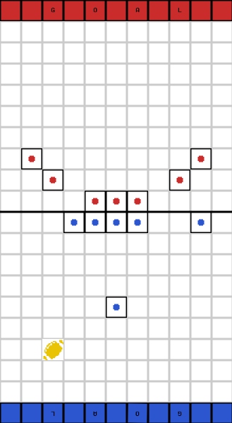
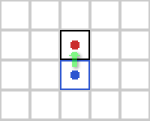
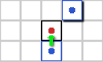
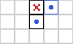
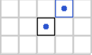
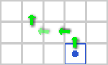
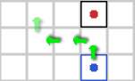
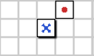

# Project 7: CodeBowl
CodeBowl is a 1v1, turn-based, tile-based, risk-management game with RPG elements. Based loosely around ball sports like soccer/american football but with ability to knock players out of the game. Inspired by classic board game: Blood Bowl. 
- 1v1: this game is a 2 player competitive game
- Turn-Based: Turns alternate between users where a user chooses actions for their team players then the other user chooses actions for their team players for 16 total turns
- Tile-Based: teams of 7 players spread out on 20Lx11W tile grid on their respective sides of the board
- Risk-management: all actions attempted by players have probabilities of failure. Strategy and careful team-building will decrease those chances
- RPG Elements: players having stats that affect their abilities
- Win Condition: kill all opponent team members or score more points than opponent by carrying the ball to the enemy goal zone

Codebowl is based off of team ball sports like soccer or american football. The game is divided into two sets of 8 turns called 'halves' where one team plays as 'offense' and the other team plays as 'defense'. At the beginning of each half, the ball is placed on a random tile on the offense's side of the board. The objective of the offensive team is to pick up the ball and run with the ball to the defense side's goal zone. The objective of the defensive team is to prevent the offensive team from scoring before all turns for the half are finished.

 
<i> After both users place their players, the ball is placed on a random tile on the offense team's half of the board. </i>

Certain events cause the offensive team to switch to defense and vice versa: when a team successfully scores a point, when a team drops the ball and the other team picks it up, or when the 8th turn ends. 

During a turn the user attempts an action for each player on their team, moving across the board, moving into the loose ball to attempt picking it up, or moving into an adjacent opponent player to attempt an attack. However, some events cause the turn to end before all players can perform an action: when a player attempts to pick up a loose ball but fails, attempts an attack but fails, or gets tripped when moving past an adjacent enemy. In these cases, the turn ends and the other user may perform actions for each of their team players. Turns alternate between users: when all players on a team have performed an action, the other team performs their turn.

Finally, the strategic element of this game comes ways that users can increase chances that their player's action will succeed: through careful placement of their players and attention to their player stats: movement, strength, agility. 

### Combat:
An attack between 2 players will have a 50% chance to knock the player down, a 25% chance to have no effect, and a 25% chance to knock the attacker down ending that user's turn prematurely. If a player attempts an attack and one of his teammates is also adjacent to the target player, there is a 75% chance to knock the player down, a 20% chance to have no effect, and a 5% chance to fail the attack. A successful knockdown moves the attacker into the tile where the target was, and the target back one tile in the direction of the attack.

 
<i> Blue player sets up an attack on red player with 50% chance success </i>

 
<i> Blue player sets up attack on red player with 75% chance success because another blue player is adjacent to target</i>

### Knockdown and Injury:
If a player fails an attack or receives a successful attack they are knocked down. This means they drop the ball if they have it and that they must 'stand up' their next action, causing a -3 penalty to their movement and an inability to trip players or perform an attack. Whenever a player is knocked down there is also a chance the player will be injured and removed from the game: with a 10% base chance and +5% for each point of strength the attacker has. 

 
<i> Blue player successfully attacks red player and knocks them down.</i>

 
<i> Blue player successfully attacks red player. Unlucky red player is injured and removed from this game.</i>

### Movement:
Players can move multiple tiles on their action up to the number of their movement stat. Each step is a transition to an adjacent tile on the board. When players attempt to move near opponent players, they may be tripped triggering their knockdown and injury. When a player with 0 Agility moves OUT OF a tile adjacent to an enemy, there is a 60% chance the move will be successful and 40% chance they are tripped. Every point of agility the player moving has increases chances of success by 10%. 

 
<i> Blue player has 4 movement stat so sets up move of 4 tiles. There is no risk in this move because the path does not move past tiles adjacent to any opponents </i>

 
<i> Blue player sets up risky move, where first step is safe, but 2nd and 3rd steps are adjacent to enemy, each one with 40% chance to be knocked down </i>

 
<i> Blue player succeeds first easy step and second risky step, but fails the third step is tripped and knocked down by the opponent player</i>

### Ball:
Players may move on to a loose ball in order to attempt picking it up. A player with base 0 agility has a 60% chance to successfully pick up the ball and each point of agility increases the success rate by 10%. If they fail the pick up, the ball scatters to a random adjacent square and the user's turn ends immediately. If the ball scatters to a tile with a player on it, that player attempts to pick up the ball. This continues until the ball is successfully picked up or lands on an empty tile. 

### Optional Advanced Features:
- when knocking down a player, attacker may select 3 tiles in the direction of the attack for the target to end up
- players who are knocked outside of board are instantly injured
- when attacking, a non-successful attack may perform a knock-back with no knockdown
- if the ball or a player holding the ball end up outside of the left and right border of board, place the ball on a random tile
- when attacking, only allies that are not adjacent to other opponents may assist you and increase chances of success
- attack success is based off of difference of strength between attacker and target
- picking up ball is based on difference of agility of attempter and opponent player adjacent to ball with highest agility
- players may gain experience that can be used to purchase special abilities that affect their success rates 
- add an 'armor' stat that offers resistance to being injured

# High Level Non-Functional Requirements
- sound OOP design
- 3-tier architecture
    - Client: browser, desktop app, mobile app, VR, or combinations
    - Server: Ruby on Rails, Django, Laravel, node.js
    - Database: SQL
- attention to common web application security concerns
- attention to privacy concerns with varying resource access for different types of users
- networked gameplay mode with 2 simultaneous players per game

# App Modes / High Level Functional Requirements
- login mode
- register mode
- user control panel mode
- show leaderboard mode
- game mode with synchronous game moves and asynchronous chat 
- show game results mode

# User Data / Privacy Requirements
- persistent user data
- guests can spectate matches and have access to match history (leaderboard mode)
- Coaches can create teams
- CSRF
- if using SQL backend, prevent SQL injection

    
# User Mode Sequences
- login  -> control panel -> manage team -> restart team -> control panel
                          \-> search for game -> game start -> control panel
- register -> create team -> control panel

# Game Flow
### High-Level Flow
1. Initial Setup
2. 6 turns per user occur, alternating between users. If User1 kills all players of User2, game is immediately over with User1 as Winner. 
3. Halftime Setup. User who played offense initially now plays defense and User who played defense now plays offense.
4. 6 turns per user occur, alternating between users. If User1 kills all players of User2, game is immediately over with User1 as Winner. 
5. Game ends. Winner is user with most points or draw if even points. 

### Setup Flow
1. (on initial setup): 50% roll to determine who plays offense and defense
2. User who plays defense places their players on their half of the board
3. User who plays offense places their players on their half of the board
4. Ball is placed randomly on offense half
5. Offense player starts their turn

### Turn Flow
1. Perform a single action for each player on their team from the following choices: 
    - Move: move <= the number of `Movement Per Turn` points for that player.
    - Attack: attempt to knock down / kill an adjacent opponent player.
2. Some events cause current user's turn to end immediately and other user's turn to begin
    - score goal
    - attack fails
    - move fails 
    - pick up ball fails

# Game Mode Requirements
### Home Screen Mode

### Login Mode

### Registration Mode

### User Control Panel Mode

### Game Play Mode

### Team Creation Mode
- pick name
- upload team image
- create 7 players
    - upload image
    - pick name
    - distribute 12 points among 3 stats: Strength, Agility, Movement 

### Game Mode Movement Mechanics
- user may select any of their players that has not finished their action to move
- movement begins with a left click of a friendly player to select it then left clicks on squares you wish to move within the movement allowance, then end with a click of submit
- right click cancels movement if not submitted and refreshes squares selected
- moving over the ball attempts to pick the ball up
- moving into an enemy attempts a combat attack
- you may not move into a square with a knocked down player
- all adjacent squares around opponents are 'tackle zones'. if you move OUT OF a square that is adjacent to an enemy you have a chance to get knocked down
    - if your players has equal agility to opponent with highest agility creating tackle zone: (60% safe, 40% knocked down) 
    - for each point higher agility than highest enemy agility, +10% safe, -10% knocked down)
    - for each point lower in agilty than highest enemy agility, -10% safe, +10% knocked down 

### Game Mode Combat Mechanics
- a player may only attack adjacent enemies
- if players have equal strength: (50% knock opponent down, 25% no effect, 25% self gets knocked down) 
- for each net point advantage, +10% knock down opponent, -5% no effect, -5% self gets knocked down)
- if multiple allies are adjacent to target enemy, chances for successful knockdown go up 
    - add 1 net point advantage for every ally not in any tackle zones with equal strength to target
    - add 2 net point advantage for every ally not in tacklezones with higher strength to target 
    - add .5 net advantage for every ally not in tacklezones with lower strength than target (final net advantage points are math.floor()'d)
- upon successful knockdown, rolls for death. Dead players are removed from the game and from the User's team permanently!
    - if attacker strength is equal to target armor: 5% chance to die
    - if attacker strength is greater than target armor: +5% for every point higher
        - EX: attacker Strength 5, target armor 5: 5% chance to die   

### Game Mode Ball Mechanics
- picking up a ball is based on agility. 
    - 3 agility gives 60% chance success to pick up ball. 
    - for each point of agility higher than 3, add +10% chance up to 90%. 
    - for each point lower than 3 -10% chance down to 30%. 
    - if any opponents are adjacent to ball, -10% chance
- if player fails to pick up ball, ball scatters to random adjacent square and User's turn is ended immediately
- if player holding ball is knocked down, ball scatters randomly within 3x3 grid from knocked down player
    -  if ball lands on a player, regardles of team, player makes a roll to pick up ball. If fails, ball scatters within 3x3 grid from that point again

